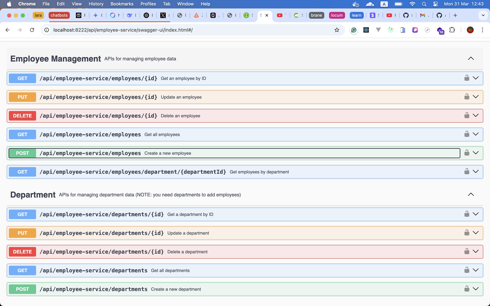
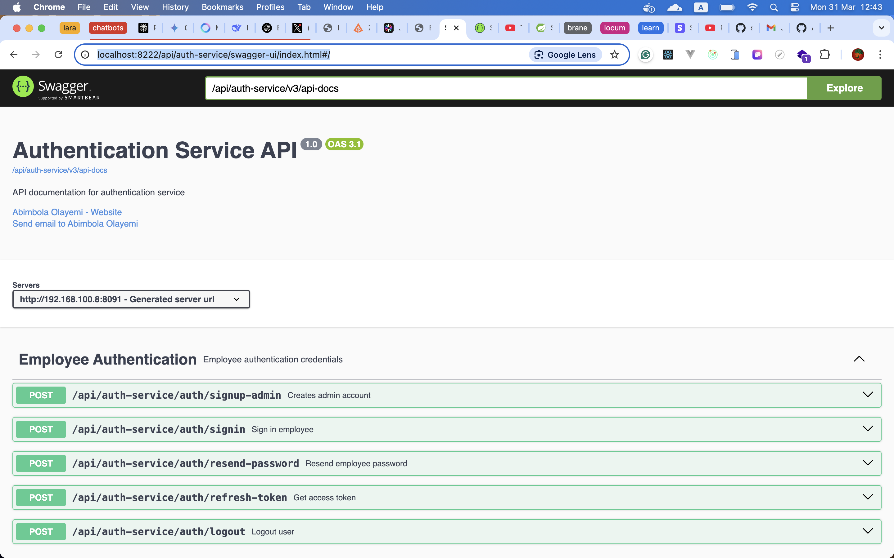

# Employee Management System

This project is my implementation of an Employee Management System, developed as part of a job application test for [SoftAlliance](https://www.softalliance.com). The requirement was to build an employee management system using a microservices architecture. I’ve extended this further by designing it as an event-driven microservices architecture to leverage asynchronous communication, scalability, and additional points in the evaluation.

The event-driven architecture is implemented using RabbitMQ as the message queue for asynchronous communication, Redis for caching, and Feign Client for synchronous service interactions where necessary.

## Architecture Overview

The system consists of the following microservices:

- Config Server: Centralized configuration management.

- Discovery Server: Service discovery using Eureka.

- API Gateway: Routes requests to appropriate services.

- Auth Service: Handles authentication and authorization.

- Employee Service: Manages employee data and operations.

- Notification Service: Sends email notifications (e.g., welcome emails with passwords).

## Prerequisites

Before running the application, ensure you have the following installed:

- Docker: For containerization (tested with Docker Desktop).

- Docker Compose: To orchestrate the services.

- Git: To clone the repository.

- A stable internet connection for pulling Docker images and Maven dependencies.

## Setup

- To start the application, use the following command from the project root directory:

  ```{bash}
    sudo docker-compose up -d
  ```

  - The -d flag runs the containers in detached mode.

  - This command builds and starts all services defined in docker-compose.yaml.

## Swagger Documentation

Once the application is running, access the Swagger UI for API documentation:

- [auth-service](http://localhost:8222/api/auth-service/swagger-ui/index.html)

- [employee-service](http://localhost:8222/api/employee-service/swagger-ui/index.html)

The API Gateway (port 8222) routes requests to the respective services.

## How to use

The system enforces three roles for employees: `ADMIN`, `MANAGER`, and `EMPLOYEE`, each with specific permissions:

- Admin: Can add, update, delete, and view all employee details.

- Manager: Can view employees in their department.

- Employee: Can view only their own details.

## Initial Setup (Admin Account)

Due to these role constraints, the first user must be an ADMIN. Use the following endpoint to create an initial admin account:

```{bash}
http://192.168.100.8:8091/api/auth-service/auth/signup-admin
```

- Note:

  - This endpoint is accessible only once (enforced by application logic).

  - It creates a default department called ADMINISTRATOR and assigns the admin to it.

## Managing Employees

After creating the admin account, use the Swagger UI or direct API calls to manage employees:

- Create a Department:

  - Endpoint: POST `http://localhost:8222/api/employee-service/departments`

- Create an Employee:

  - Endpoint: POST `http://localhost:8222/api/employee-service/employees`
  - Note: Upon creation, the employee receives an email with their password (handled by the Notification Service).

- Other Operations:
  - View, update, and delete employees as per role permissions.
  - Refer to the Swagger documentation for detailed endpoints and request/response formats.

## Key Features

- Role-Based Access Control (RBAC): Ensures users only perform actions allowed by their role.

- Event-Driven Design: Employee creation triggers an email notification via RabbitMQ.

- Caching: Redis improves performance for frequently accessed data.

- Service Discovery: Eureka enables dynamic service registration and discovery.

- API Gateway: Simplifies client interactions by routing requests and jwt token validation.

## Future Improvements

- Implement rate limiting at the API Gateway.

## Pictures of swagger docs



